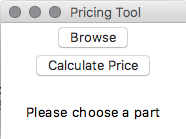
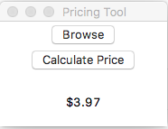

#  Pricing Tool for 3D printed parts

##  Problem:

The 3D printing club at Chico state has a website where students can upload 
their parts. It is difficult however to price these parts efficiently as the 
person who prints these parts must slice and run the gcode through a parser to
find how much time and volume the parts will consume and the price can be quoted.

## Proposal:

Build a tool which can be deployed on AWS which can be embedded into the 
website to allow a user to upload their part and recieve a quote in a timely 
manner. Also making the website more interactive and contain more club 
information would be very beneficial.

#  Current tool:

This tool takes a standard .STL file and slices it using generic settings, 
parses the gcode to interpret time to completion of the part, and the volume of
 the part, then sends this information to our Google Sheet for pricing and retu
 rns the calculated price to the user.

 

 